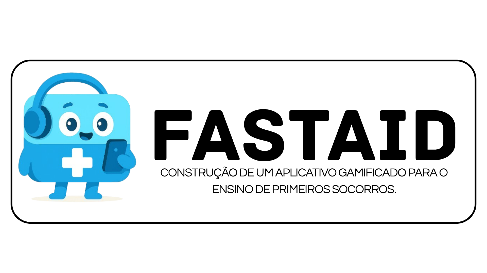

> "O instinto de salvar vidas, agora no bolso de cada estudante."

O **FastAID** é um sistema gamificado voltado para o ensino de primeiros socorros. Nosso objetivo é transformar o aprendizado de procedimentos de emergência — frequentemente percebidos como complexos ou intimidantes — em uma experiência autônoma, interativa e engajadora através de microlearning e mecânicas de jogos.

---

## 📝 Resumo
O projeto nasceu da necessidade de democratizar o acesso ao conhecimento sobre primeiros socorros. Através do uso de Tecnologias de Informação e Comunicação (TICs), desenvolvemos uma plataforma que capacita o usuário a agir corretamente em situações de risco, garantindo que o conhecimento esteja disponível mesmo offline, quando cada segundo é crucial.

## 👥 Equipe
Este projeto foi desenvolvido como Trabalho de Conclusão de Curso (TCC) no Instituto Federal do Paraná (IFPR) - Campus Pinhais.

- **Eduardo Cornehl Jungles Gonçalves** 
- **Otavio Henrique Batista Moreira**
- **Izaque Esteves da Silva.** (Orientador)
- **Ana Carolina** (Coorientador)
- **Claudio Kleina** (Coorientador)
  
---

## 🎨 Identidade Visual
A identidade visual do FastAID foi projetada para transmitir confiança, rapidez e clareza, utilizando uma paleta de cores intuitiva e suporte nativo a temas Claro/Escuro.

- <a href="IDENTIDADE VISUAL.pdf">IDENTIDADE VISUAL</a>
---

## 📂 Documentação de Requisitos
Acesse os documentos oficiais do projeto:

- <a href="https://docs.google.com/document/d/1nSJk9xR6WyFck1RpfgltVux6g6GoOaTC0R9CgH0CTpc/edit?usp=sharing">DOCUMENTO DE REQUISITOS</a>

---

## 📱 Protótipo de Telas
Visualize o protótipo interativo desenvolvido:

- <a href="https://app.quant-ux.com/#/test.html?h=a2aa10aywXFRXjubi3vfSV3j5JOlefgQxRUhZSdz8QjsnYEd4SNRF2vkjiHC&ln=en">PROTÓTIPO DE TELAS</a>

---

## DIAGRAMAS DE CASO DE USO
Visualize os diagramas desenvolvidos:

- <a href="https://docs.google.com/document/d/1pcCjMckxj-t0U7pb-YpIVSUZhZLy_5_X8BUk1Viub5I/edit?usp=sharing">PROTÓTIPO DE TELAS</a>

